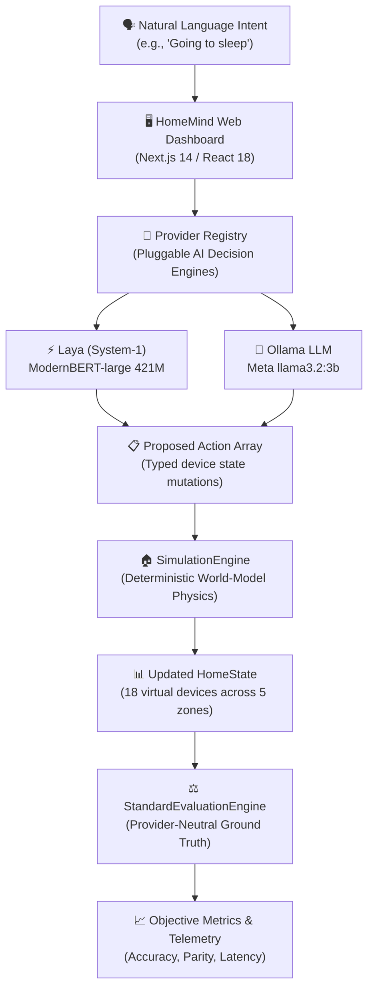
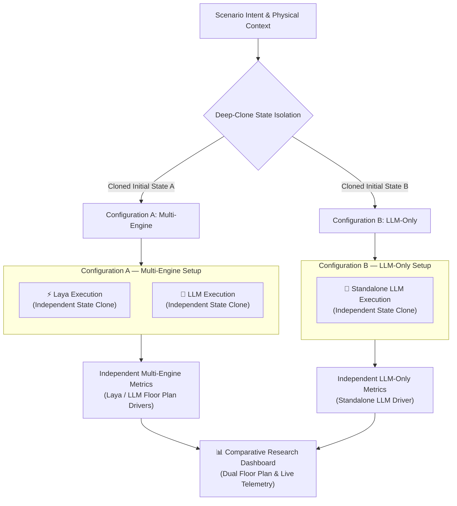

# 🏠 HomeMind
### Context-Aware Multi-Device Smart Home Automation

[](https://github.com/gowthxm07/Smart-Home-Automation-Using-Laya/releases/tag/v1.0-final)
[](https://github.com/gowthxm07/Smart-Home-Automation-Using-Laya)
[](https://www.typescriptlang.org/)
[](https://nextjs.org/)
[](https://react.dev/)
[](https://tailwindcss.com/)
[](https://github.com/gowthxm07/Smart-Home-Automation-Using-Laya)
[](https://ollama.com/)

**HomeMind** is an open-source, software-simulated smart-home automation and research platform that evaluates AI decision engines on translating natural-language user intent into multi-device state transitions. By conditioning decisions on a real-time, multi-room physical world model, HomeMind investigates state awareness—eliminating redundant, unnecessary, or conflicting actuations across smart devices.

> [!IMPORTANT]
> **100% Software-Simulated Smart Home — Zero Physical Hardware Required**<br/>
> HomeMind is entirely self-contained software. It does **NOT** require physical IoT microcontrollers (ESP32 / Arduino), relays, smart plugs, Zigbee bridges, or physical sensors. All device attributes, room topologies, environmental variables, and physical state transitions are modeled in a deterministic in-memory simulation engine.

*Note on Repository Naming*: The official GitHub repository is [`Smart-Home-Automation-Using-Laya`](https://github.com/gowthxm07/Smart-Home-Automation-Using-Laya), while the software application and research system identity is **HomeMind**.

---

## 🧠 How It Works

HomeMind formulates smart home control as a **state-conditioned intent translation problem**:



1. **User Provides Intent**: A natural-language prompt (e.g., *"I'm going to bed, lock up and turn off the lights"*) is submitted.
2. **Provider Interprets Intent**: The active AI model receives the prompt along with the complete JSON state of all 18 virtual devices.
3. **Provider Proposes Actions**: The model extracts parameters and proposes discrete state mutations (e.g., `bedroom_light: TURN_OFF`).
4. **Actions Are Simulated**: `SimulationEngine` validates device capabilities, checks boundaries, and transitions the virtual world model.
5. **Resulting State Is Evaluated**: `StandardEvaluationEngine` assesses the outcome against frozen ground-truth targets.
6. **Telemetry & Visuals Displayed**: Independent action parsimony, state accuracy, and sub-millisecond simulation metrics render live on the dashboard.

---

## ✨ Key Features

- 🤖 **AI-Powered Natural-Language Automation**: Translates free-form spoken or typed commands into coordinated multi-device state changes.
- 🏠 **Virtual Smart-Home Simulation**: Models 18 multi-attribute devices across 5 distinct rooms (Living Room, Bedroom, Kitchen, Office, Hallway).
- 🔀 **Multi-Provider Architecture**: Decoupled Strategy Pattern (`ProviderRegistry`) supporting hot-swappable AI inference backends.
- ⚡ **Laya Decision Engine**: Local System-1 non-autoregressive decision model (`ModernBERT-large`, 421M parameters) running on local CPU via `laya-serve`.
- 🧠 **Local Ollama LLM**: Open-weights `llama3.2:3b` executing locally with zero temperature and structured JSON schemas.
- 🧩 **Provider-Neutral Evaluation**: Objective grading contract (`StandardEvaluationEngine`) completely independent of model prompts or APIs.
- 🔒 **Strict State Isolation**: Deep-cloned independent state allocation guaranteeing zero cross-provider or cross-repetition state leakage.
- 📊 **Research Metrics**: Comprehensive tracking of matched required, missed required, unnecessary, and forbidden actions.
- 🧪 **Controlled Benchmark Dataset**: 36 frozen scenarios across 7 operational categories with SHA-256 cryptographic locking.
- 📈 **Comparative Research Dashboard**: Dual-floor-plan real-time visualization, decision telemetry, and side-by-side execution inspector.
- 🔬 **Reproducible Research Pipeline**: Full 360-cell factorial grid protocol with streaming raw execution logs (`runs.jsonl`).

---

## 🏗️ Comparative Execution Architecture

HomeMind features a dual-configuration comparative execution harness that runs two setups side-by-side against the exact same scenario and initial state:



> [!NOTE]
> **Independent State Clones — No Merged Decisions**<br/>
> In the Multi-Engine configuration, Laya and LLM execute independently on separate state clones. They do **not** merge or jointly generate actions. Each execution is evaluated separately, enabling direct observation of architectural characteristics under identical initial conditions.

---

## 🤖 AI Provider Ecosystem

| Provider | Architecture | Model / Runtime | Hosting | Role in HomeMind |
|:---|:---|:---|:---:|:---|
| **LAYA** | Non-autoregressive classification & parameter extraction | `ModernBERT-large` (421M params), `laya-serve 0.3.20` | Local CPU | **ACTIVE / LIVE** — High-speed, parsimonious decision model with upstream domain router. |
| **LLM** | Autoregressive generative language model | Meta `llama3.2:3b`, Ollama daemon (`temperature = 0.0`) | Local CPU | **ACTIVE / LIVE** — Broad natural-language understanding with structured JSON action output. |
| **JEV** | Cloud API decision service | TypeSafe Jev API | Cloud | **HISTORICAL / NON-LIVE** — Preserved in `src/lib/jev/` for research provenance; 0 active benchmark cells. |

*Provider Clarification*: Jev was used during earlier development and benchmark infrastructure stages but is not part of the current live runtime.

---

## 🔬 Controlled Research Experiment

The HomeMind research benchmark evaluates context-aware decision quality across a controlled factorial matrix:

```mermaid
flowchart LR
    Scenarios["36 Frozen Scenarios\n(7 Categories)"] --> Reps["5 Repetitions\nPer Cell"]
    Reps --> Providers["2 Active Providers\n(LAYA & LLM)"]
    Providers --> Matrix["360 Factorial Cells\n(Controlled Protocol)"]
    Matrix --> Telemetry["Raw Logs\n(runs.jsonl)"]
    Telemetry --> Eval["Neutral Evaluator\n(Populations A–E)"]
    Eval --> Stats["Canonical Stats\n(SD: 0.30 / 0.28)"]
    Stats --> Pubs["12 SVG Figures\n7 Data Tables"]
    Pubs --> Report["Final Report\n(docs/research/)"]
```



- **Experiment Identifier**: `exp_ctrl_1790945358821_ibkjxz`
- **Dataset Invariant**: `HomeMind-Eval-Dataset-v1.0` (SHA-256: `66de3242d1ba6583dc385a2999f8f8ba556a1f52cf5862cc7f223c9cdbfc0329`)
- **Factorial Grid**: 36 scenarios $\times$ 2 active providers $\times$ 5 repetitions = **360 execution cells**
- **Analysis Populations**:
  - **Population A** (All planned cells): **360** (180 LAYA, 180 LLM)
  - **Population B** (Supported cells): **350** (170 LAYA, 180 LLM)
  - **Population C** (Supported successful executions): **341** (166 LAYA, 175 LLM)
  - **Population D** (Supported execution failures): **9** (4 LAYA CPU timeouts; 1 LLM timeout, 4 LLM entity hallucinations)
  - **Population E** (Unsupported domain rejections): **10** (10 LAYA router rejections on out-of-domain scenarios, 0 LLM)

### Canonical Empirical Results (Population C: $N=341$)

| Metric Parameter | LAYA (System-1, $N=166$) | LLM (Ollama `llama3.2:3b`, $N=175$) |
|:---|:---:|:---:|
| **Supported Successful Executions** | 166 | 175 |
| **Supported Failures** | 4 | 5 |
| **Unsupported Domain Rejections** | 10 | 0 |
| **Mean Matched Required Actions** | 1.60 ± 1.52 | 1.17 ± 1.38 |
| **Mean Missed Required Actions** | 1.29 ± 1.24 | 1.74 ± 1.52 |
| **Mean Unnecessary Actions** | **0.31 ± 0.46** | **2.02 ± 2.62** |
| **Mean Forbidden Actions** | **0.00 ± 0.00** | **0.08 ± 0.27** |
| **Mean State Accuracy Ratio** | **0.67 ± 0.30** (Median: 0.67) | **0.49 ± 0.28** (Median: 0.50) |
| **Median Decision Latency** | **34,880.84 ms** (Mean: 36,488.06 ms) | **41,869.63 ms** (Mean: 50,569.15 ms) |
| **Mean Simulation Latency** | **0.31 ms** | **1.16 ms** |
| **Mean Evaluation Latency** | **0.24 ms** | **0.65 ms** |
| **Inference Latency Share** | **>99.99%** | **>99.99%** |

> [!NOTE]
> These measurements describe different behavioral dimensions under the controlled protocol; the project does not assign an overall provider ranking or composite score.

---

## 💻 Tech Stack

- **Framework**: [Next.js 14.2](https://nextjs.org/) (App Router, Server & Client Components)
- **UI & Styling**: [React 18.3](https://react.dev/), [Tailwind CSS 3.4](https://tailwindcss.com/), [Lucide React](https://lucide.dev/)
- **Programming Language**: [TypeScript 5.6](https://www.typescriptlang.org/) (Strict type checking)
- **Testing & Verification**: [Vitest 2.1](https://vitest.dev/) (23 test suites, 279 unit & integration tests)
- **AI Runtimes**:
  - [Ollama](https://ollama.com/) local daemon serving `llama3.2:3b`
  - `laya-serve 0.3.20` local daemon serving `ModernBERT-large` (421M params)
- **State & Simulation Engine**: Pure in-memory deterministic state machine with immutable TypeScript snapshots

---

## 🚀 Quick Start

### Prerequisites
- [Node.js](https://nodejs.org/) v20.x or v22.x LTS (`node -v`)
- [npm](https://www.npmjs.com/) v10.x (`npm -v`)
- [Ollama](https://ollama.com/) installed and running locally
- Python 3.10+ / `laya-serve` (optional for live Laya inference)

### 1. Installation

```bash
# Clone the repository
git clone https://github.com/gowthxm07/Smart-Home-Automation-Using-Laya.git
cd Smart-Home-Automation-Using-Laya

# Install project dependencies
npm install
```

### 2. Environment Configuration

```bash
# Copy example environment configuration
cp .env.example .env.local
```

### 3. Start AI Services

In separate terminal windows:

```powershell
# Terminal 1: Start Laya System-1 daemon
laya-serve --model english --port 8080

# Terminal 2: Start Ollama LLM service
ollama serve
# Ensure model is downloaded: ollama pull llama3.2:3b
```

### 4. Start HomeMind Application

```powershell
# Terminal 3: Start Next.js development server
npm run dev
```

Navigate to **`http://localhost:3000`** in your browser to access the interactive dashboard.

---

## 🎬 Live Demonstration

For a step-by-step evaluator walkthrough covering startup, preset scenario demonstrations (1 through 7), failure recovery, and research comparison views, consult:

👉 **[`docs/DEMO_GUIDE.md`](docs/DEMO_GUIDE.md)** — Faculty & Reviewer Operational Manual

---

## 📚 Research Documentation

The complete academic publication and evaluation package is organized under `docs/`:

| Document | Focus & Description |
|:---|:---|
| 📄 [`docs/research/HOMEMIND_FINAL_RESEARCH_REPORT.md`](docs/research/HOMEMIND_FINAL_RESEARCH_REPORT.md) | **Comprehensive Academic Research Report** (17 sections detailing methodology, results, and discussion). |
| 📊 [`docs/research/RESULTS_SUMMARY.md`](docs/research/RESULTS_SUMMARY.md) | **Results Executive Briefing** (Quick-reference tables and key findings for viva). |
| 🔁 [`docs/research/REPRODUCIBILITY.md`](docs/research/REPRODUCIBILITY.md) | **Reproducibility Guide** (Step-by-step replication protocol and verification checks). |
| 🗂️ [`docs/research/ARTIFACT_INDEX.md`](docs/research/ARTIFACT_INDEX.md) | **Research Artifact Manifest** (Inventory of source, dataset, benchmark, and visualization assets). |
| 📈 [`docs/research/FIGURE_TABLE_REFERENCE.md`](docs/research/FIGURE_TABLE_REFERENCE.md) | **Figures & Tables Guide** (Detailed mapping for Figures 1–12 and Tables 1–7). |
| 🛡️ [`docs/research/3.24_FINAL_END_TO_END_AUDIT.md`](docs/research/3.24_FINAL_END_TO_END_AUDIT.md) | **System Audit Certification** (20 assessment categories: 20 PASS, 0 WARN, 0 BLOCK). |
| 🎓 [`docs/VIVA_GUIDE.md`](docs/VIVA_GUIDE.md) | **Oral Defense Preparation Guide** (30s/1m pitches, 33 technical Q&As, canonical metric cheat sheet). |
| 📋 [`docs/PROJECT_STATUS.md`](docs/PROJECT_STATUS.md) | **Official Project Status Ledger** (Declaration of frozen state and post-freeze policies). |

---

## 🗂️ Repository Structure

```
Smart-Home-Automation-Using-Laya/
├── artifacts/
│   ├── analysis/controlled-experiment/  # Statistical analysis summaries & JSON metrics
│   │   └── visualizations/              # 12 publication SVG figures & 7 data tables
│   └── benchmarks/                      # Raw 360-cell experiment telemetry (runs.jsonl)
├── docs/
│   ├── DEMO_GUIDE.md                    # Faculty & reviewer demonstration manual
│   ├── VIVA_GUIDE.md                    # Technical defense & oral exam preparation guide
│   ├── PROJECT_STATUS.md                # Official project status ledger (FROZEN)
│   └── research/                        # Academic paper, reproducibility guide, artifact index
├── scripts/
│   ├── runControlledExperiment.ts       # 360-cell controlled benchmark orchestrator
│   └── generateBaselineAnalysis.ts      # Statistical aggregation & table generation
├── src/
│   ├── app/                             # Next.js App Router (Dashboard & Research views)
│   ├── components/                      # UI components (Floor Plan, Traces, Telemetry)
│   ├── context/                         # React HomeContext state management
│   ├── lib/
│   │   ├── evaluation/                  # StandardEvaluationEngine & 36 frozen scenarios
│   │   ├── providers/                   # Provider Registry, Laya & Ollama LLM drivers
│   │   ├── simulationEngine.ts          # Deterministic world-model state machine
│   │   └── jev/                         # Preserved historical Jev artifacts (0 active cells)
│   └── tests/                           # Vitest automated test suite (279 passing tests)
├── .env.example                         # Environment configuration template
├── package.json                         # Project dependencies and operational scripts
└── README.md                            # Project landing documentation
```

---

## ⚠️ Research Limitations

1. **Software Simulation**: Evaluated in a deterministic software world model; physical RF attenuation, Zigbee packet drop, and relay contact bounce were not modeled.
2. **Local CPU Execution**: Inference latencies reflect consumer-grade CPU compute bounds rather than hardware-accelerated edge TPUs or dedicated GPUs.
3. **Discrete Scenario Scope**: 36 controlled scenarios across 5 repetitions profile core smart home behaviors but do not represent unconstrained multi-turn conversations.
4. **Model Checkpoint Specifics**: Findings characterize `laya-serve 0.3.20 (english)` and Meta's `llama3.2:3b`.
5. **Uncalibrated Model Confidence**: Laya confidence probabilities were raw network activations and not independently calibrated.

---

## 👨‍💻 Author

**Gowtham Hari S**

- Official Repository: [Smart-Home-Automation-Using-Laya](https://github.com/gowthxm07/Smart-Home-Automation-Using-Laya)
- Project: **HomeMind — Context-Aware Multi-Device Smart Home Automation**
